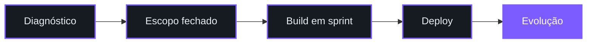

 

**Isaque** · Founder &amp; CEO

<!--
  CONTATOS: descomente e troque quando tiver os links.
  
  
  
-->

---

## Sobre

Me chamo Isaque e toco a **Buildo Tecnologia**.

A gente faz site, aplicativo e automação pra empresa. Não é template de R$ 300, e também não é aquele
sistema que só o dev que escreveu consegue mexer depois.

O tipo de coisa que mais chega aqui é empresa afogada em trabalho manual. Pedido que alguém digita
duas vezes. Planilha que quatro pessoas editam ao mesmo tempo e ninguém sabe qual versão vale.
Cliente esperando resposta no WhatsApp às 22h. Tudo isso vira software, e normalmente em poucas semanas.

Se o teu problema é esse, dá pra resolver.

---

## O que a gente faz

| | |
| :--- | :--- |
| **Site e landing page** | Institucional, página de conversão e loja. Eu me importo com PageSpeed no verde porque site lento queima tráfego pago, e tráfego pago é caro. |
| **Aplicativo** | Web, PWA e mobile. Começo pelo MVP, coloco no ar rápido, e a evolução vem em cima de uso real e não de achismo. |
| **Automação e IA** | n8n, integração de API e agente com LLM. Se alguém do time repete a mesma tarefa toda segunda, aquilo ali é robô. |
| **Sistema sob medida** | Painel, dashboard, ERP enxuto, integração com gateway de pagamento. É aqui que a operação para de depender de planilha. |
| **Consultoria** | Produto que já existe e travou. Eu olho stack, arquitetura e performance, e digo o que dá pra salvar e o que é melhor reescrever. |

---

## Como funciona

Primeiro eu entendo o que está travando a operação. Depois mando escopo fechado, com prazo e preço,
porque "a gente vê depois" é como projeto morre. O desenvolvimento roda em sprint curta e você
acompanha por um link de homologação, sem precisar esperar o fim pra ver alguma coisa.
Quando entra no ar, tem treinamento do time e suporte pra continuar evoluindo.

---

## Stack

 

 

Fora dos ícones: n8n para automação, Stripe e gateways nacionais, e agentes com LLM.

---

## Projetos

<table>
<tr>
<td width="50%" valign="top">

### 🎯 MoveBet
Plataforma de apostas em React 19, TypeScript e Tailwind v4.
Navegação com fonte única de verdade, carrossel com snap nativo,
estado que sobrevive ao refresh e design system próprio.

</td>
<td width="50%" valign="top">

### ⚙️ Automação de operação
Fluxo que pega o pedido no WhatsApp, joga no CRM
e avisa o financeiro. Ninguém digita nada duas vezes.

</td>
</tr>
<tr>
<td width="50%" valign="top">

### 📊 Painel sob medida
Dashboard que substituiu a planilha compartilhada.
Permissão por usuário, histórico e número batendo com o financeiro.

</td>
<td width="50%" valign="top">

### 📱 App mobile
Do MVP validado até a publicação nas lojas,
já com base pronta pra aguentar crescimento.

</td>
</tr>
</table>

<!-- Troque os 3 ultimos por case real com numero assim que puder. "Cortou 70% do tempo de fechamento" vale mais que qualquer descricao de stack. -->

---

## GitHub

---

## Chamar a Buildo

Pego projeto de site, app, automação e sistema sob medida. Também pego parceria longa
com time que precisa de um braço técnico fixo em vez de freela novo a cada trimestre.

**[Falar comigo](https://github.com/devkrowmys)**

